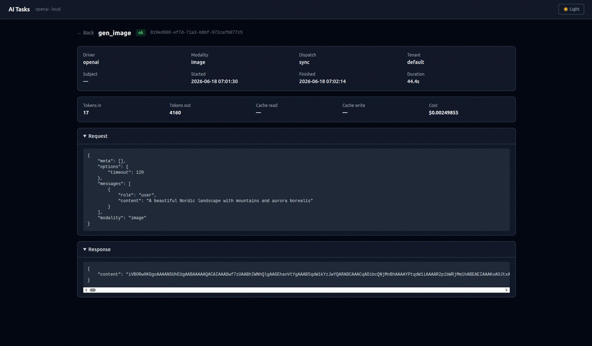

# Laravel AI Tasks

[](https://packagist.org/packages/fomvasss/laravel-ai-tasks)
[](https://packagist.org/packages/fomvasss/laravel-ai-tasks)
[](https://packagist.org/packages/fomvasss/laravel-ai-tasks)

## Підтримка

Якщо цей пакет є корисним для вас, розгляньте можливість підтримки його розробки:

[](https://send.monobank.ua/jar/5xsqtHvVrY)
[](https://ko-fi.com/fomvasss)
[](https://link.trustwallet.com/send?coin=195&address=THLgp6DxiAtbNHvgnKV56vk1L38UuUagKf&token_id=TR7NHqjeKQxGTCi8q8ZY4pL8otSzgjLj6t)

> Адреса USDT TRC20: `THLgp6DxiAtbNHvgnKV56vk1L38UuUagKf`

Оркестратор AI-задач для Laravel. Маршрутизація, черги, аудит-лог, бюджети, вебхуки — поверх [laravel/ai](https://laravel.com/docs/ai-sdk) як транспортного шару.

[English documentation](README.md)

## Dashboard

Вбудований веб-інтерфейс за адресою `/ai-tasks` — список runs зі статистикою, фільтрами та деталями кожного запиту (request, response, токени, вартість).



Конфігурується в `config/ai-tasks.php`:

```php
'dashboard' => [
    'enabled'       => env('AI_DASHBOARD_ENABLED', true),
    'path'          => env('AI_DASHBOARD_PATH', 'ai-tasks'),
    'middleware'    => ['web'],
    'poll_interval' => env('AI_DASHBOARD_POLL', 3),        // секунди; 0 = вимкнути
    'theme'         => env('AI_DASHBOARD_THEME', 'system'), // light|dark|system
    'per_page'      => env('AI_DASHBOARD_PER_PAGE', 50),
],
```

## Вимоги

- PHP ^8.3
- Laravel ^12 | ^13
- [laravel/ai](https://laravel.com/docs/ai-sdk) ^0.8

## Встановлення

```bash
composer require fomvasss/laravel-ai-tasks
```

Публікуємо конфіги та запускаємо міграції:

```bash
# laravel/ai — конфіг провайдерів (API-ключі)
php artisan vendor:publish --provider="Laravel\Ai\AiServiceProvider" --tag=ai-config

# цей пакет — маршрутизація, бюджети, черги
php artisan vendor:publish --tag=ai-tasks-config

php artisan vendor:publish --tag=ai-migrations
php artisan migrate
```

Додай ключі до `.env` — credentials читає `laravel/ai`:

```env
AI_DEFAULT=openai

OPENAI_API_KEY=sk-...
ANTHROPIC_API_KEY=sk-ant-...
GEMINI_API_KEY=...
DEEPSEEK_API_KEY=sk-...
GROQ_API_KEY=gsk_...
```

### Два конфіг-файли

| Файл | Призначення |
|---|---|
| `config/ai.php` | laravel/ai — API-ключі, URL провайдерів |
| `config/ai-tasks.php` | цей пакет — моделі, ціни, маршрутизація, бюджети |

## Horizon / Черги

За замовчуванням використовуються дві черги:

```env
AI_QUEUE=ai
AI_QUEUE_POST=ai-post
```

Приклад конфігурації Horizon:

```php
'supervisor-ai' => [
    'connection'   => 'redis',
    'queue'        => ['ai'],
    'balance'      => 'auto',
    'minProcesses' => 2,
    'maxProcesses' => 20,
    'tries'        => 3,
    'timeout'      => 300,
],
'supervisor-ai-post' => [
    'connection'   => 'redis',
    'queue'        => ['ai-post'],
    'balance'      => 'simple',
    'minProcesses' => 1,
    'maxProcesses' => 8,
    'tries'        => 3,
    'timeout'      => 60,
],
```

## Створення таску

```bash
php artisan ai:make-task SummarizeTask
php artisan ai:make-task Orders/AnalyzeTask --queued
```

```php
<?php

declare(strict_types=1);

namespace App\Ai\Tasks;

use Laravel\Ai\Messages\UserMessage;
use Fomvasss\AiTasks\DTO\AiPayload;
use Fomvasss\AiTasks\DTO\AiResponse;
use Fomvasss\AiTasks\Tasks\AiTask;

class SummarizeTask extends AiTask
{
    public function __construct(
        private readonly string $text,
    ) {}

    public function modality(): string
    {
        return 'text';
    }

    public function toPayload(): AiPayload
    {
        return new AiPayload(
            modality: $this->modality(),
            messages: [new UserMessage("Стисни текст: {$this->text}")],
            systemPrompt: 'Ти помічник-редактор. Відповідай максимум 3 реченнями.',
            options: ['temperature' => 0.3],
        );
    }

    public function postprocess(AiResponse $response): AiResponse|array
    {
        // зберегти в БД, відправити подію тощо
        return $response;
    }
}
```

## Запуск задач

```php
use Fomvasss\AiTasks\Facades\AI;

// Синхронно
$response = AI::send(new SummarizeTask($text));
echo $response->content;

// Асинхронно (черга)
$runId = AI::queue(new SummarizeTask($text));

// Стрімінг
$response = AI::stream(new SummarizeTask($text), function (string $chunk) {
    echo $chunk;
});
// $response->content — повний накопичений текст
// $response->usage  — токени + вартість (як у AI::send)

// Перевизначити драйвер на льоту
$response = AI::send(new SummarizeTask($text), drivers: 'anthropic');
```

## Стрімінг

`AI::stream()` передає текст відповіді чанками через callback — зручно для real-time UI (SSE, WebSockets).

```php
$response = AI::stream(
    new SummarizeTask($text),
    function (string $chunk) {
        echo $chunk;           // або: event('stream', $chunk)
    },
    drivers: ['openai'],       // опціональний override драйвера
);

// Після завершення стріму:
$response->content;            // повний накопичений текст
$response->usage;              // токени + вартість
```

### Підтримка провайдерів

Всі провайдери `laravel/ai` підтримують streaming — OpenAI, Anthropic, Gemini, DeepSeek, Groq, Mistral, xAI, Ollama та будь-який OpenAI-сумісний endpoint.

### Довгі відповіді

`AI::send()` має дефолтний таймаут 60 секунд. Для великих відповідей (статті, розповіді) використовуй `AI::stream()` — у нього немає таймауту за замовчуванням:

```php
$response = AI::stream(new WriteStoryTask(), function (string $chunk) {
    // обробляй чанки або ігноруй
}, drivers: ['deepseek']);

$response->content; // повний накопичений текст
```

## Маршрутизація драйверів

Маршрути задаються у `config/ai-tasks.php`:

```php
'routing' => [
    'summarize'      => ['openai', 'anthropic'], // основний + fallback
    'orders_analyze' => ['gemini'],
],
```

Або безпосередньо на інстансі таску:

```php
AI::send((new SummarizeTask($text))->viaDrivers('gemini'));
```

## Multi-tenant бюджет

```php
// config/ai-tasks.php
'budgets' => [
    'tenant-abc' => ['monthly_usd' => 50.0],
    'default'    => ['monthly_usd' => 100.0],
],
```

`TenantResolver` визначає `tenant_id` з заголовка `X-Tenant-Id`, авторизованого користувача або конфігу. Щоб замінити — збіндити власний клас:

```php
$this->app->scoped(\Fomvasss\AiTasks\Support\TenantResolver::class, fn() => new MyTenantResolver());
```

## Відстеження витрат

Задай ціни у `config/ai-tasks.php` (за 1M токенів у USD):

```php
'anthropic' => [
    'model' => 'claude-sonnet-4-6',
    'price' => [
        'in'          => 3.00,
        'out'         => 15.00,
        'cache_write' => 3.75,
        'cache_read'  => 0.30,
    ],
],
```

Вартість розраховується після кожного запиту і зберігається в `ai_runs.cost`. Якщо `price` не задано — `cost` буде `null`, але кількість токенів завжди записується.

Аналітика витрат по тенанту через SQL:

```php
AiRun::where('tenant_id', $tenantId)
    ->where('status', 'ok')
    ->sum('cost'); // швидкий SQL-запит, проіндексована колонка
```

## Кешування промптів (Anthropic)

```php
return new AiPayload(
    modality:     'text',
    messages:     [new UserMessage($prompt)],
    systemPrompt: $longSystemPrompt,
    options:      ['cache' => true], // кешує systemPrompt на стороні Anthropic
);
```

## Задачі в черзі

Реалізуй `ShouldQueueAi` і визнач `serializeForQueue()`:

```php
use Fomvasss\AiTasks\Contracts\ShouldQueueAi;

class AnalyzeTask extends AiTask implements ShouldQueueAi
{
    public function __construct(private readonly int $productId) {}

    public function serializeForQueue(): array
    {
        return [$this->productId];
    }

    public function viaQueues(): array
    {
        return ['request' => 'ai', 'post' => 'ai-post'];
    }
}
```

### Відкладений запуск (delay)

Передай `delay` у `AI::queue()` щоб відкласти виконання:

```php
AI::queue(new SummarizeTask($text), delay: 300);                 // 5 хвилин (секунди)
AI::queue(new SummarizeTask($text), delay: now()->addHours(2));  // Carbon
AI::queue(new SummarizeTask($text), delay: new \DateInterval('PT10M'));
```

### Перевірка перед виконанням — `shouldRun()`

Перевизнач `shouldRun()` у будь-якому таску, щоб зробити останню перевірку всередині job-а, **до** виклику API. Якщо метод повертає `false` — run отримує статус `skipped`, токени не витрачаються:

```php
class AnalyzeProductTask extends AiTask
{
    public function __construct(private readonly int $productId) {}

    public function shouldRun(): bool
    {
        // перевіряємо актуальний стан в момент виконання
        return Product::find($this->productId)?->needs_analysis ?? false;
    }
}
```

Корисно коли задача в черзі може втратити актуальність до того, як воркер її підхопить (запис видалено, статус змінився, результат вже є).

### Ідемпотентність

Кожен run захищений від дублів через унікальний `idempotency_key` в `ai_runs`. Дефолтний ключ — хеш від `[tenantId, taskName, modality, serializeForQueue()]`, тому задачі з різними вхідними параметрами автоматично отримують різні ключі.

Перевизнач `idempotencyKey()` для власної логіки дедублікації:

```php
class ChatTask extends AiTask
{
    public function __construct(
        private readonly string $question,
        private readonly string $messageId, // унікальний ID повідомлення з чат-системи
        private readonly array  $history = [],
    ) {}

    public function serializeForQueue(): array
    {
        return [$this->question, $this->messageId, $this->history];
    }
    // idempotencyKey() за замовчуванням — включає messageId, кожен turn унікальний
}
```

Для чат/асистент-інтеграцій, де одне й те саме питання може задаватись кілька разів: поки в `serializeForQueue()` є `messageId` або повна історія чату — кожен turn дає унікальний ключ, і idempotency захищає тільки від технічних дублів (double-send, retry черги).

## Інструменти (Tools)

Перевизнач `tools()` у будь-якому таску, щоб передати `Laravel\Ai\Contracts\Tool[]` в `AnonymousAgent`. Інструменти автоматично передаються при `send()`, `stream()` і `queue()`.

```php
class ResearchTask extends AiTask
{
    public function tools(): array
    {
        return [
            new class implements Tool {
                public function name(): string        { return 'web_search'; }
                public function description(): string { return 'Search the web for current information.'; }

                public function handle(Request $request): string
                {
                    return json_encode(['results' => ['Result for: ' . ($request['query'] ?? '')]]);
                }

                public function schema(JsonSchema $schema): array
                {
                    return ['query' => $schema->string('The search query')];
                }
            },
        ];
    }
}
```

**Важливо:** анонімний клас, що реалізує `Tool`, повинен мати метод `name()` — без нього `ToolNameResolver` генерує невалідну назву для OpenAI API.

## MCP-інструменти

Підключення до зовнішнього MCP-сервера (Streamable HTTP, JSON-RPC 2.0) без встановлення `laravel/mcp`:

```php
class CrmTask extends AiTask
{
    public function tools(): array
    {
        $client = new HttpMcpClient(
            url: config('services.crm_mcp.url'),
            token: config('services.crm_mcp.token'),
        );

        return collect($client->listTools())
            ->map(fn(array $t) => new HttpMcpTool(
                client: $client,
                name: $t['name'],
                toolDescription: $t['description'] ?? $t['name'],
                inputSchema: $t['inputSchema'] ?? [],
            ))
            ->all();
    }
}
```

Повний приклад реалізації `HttpMcpClient` і `HttpMcpTool` — у розділі **MCP Tools** англомовного README.

## Таймаут завдань черги

Перевизнач `jobTimeout()` для контролю максимального часу виконання job-а в черзі:

```php
class HeavyTask extends AiTask
{
    public function jobTimeout(): int { return 600; } // секунди, дефолт 300
}
```

Значення передається в `ProcessAiPayload` при диспетчеризації. Supervisor Horizon повинен мати `timeout` не менший за максимальний `jobTimeout()` у ваших задачах.

## Laravel Octane

Додаткова конфігурація не потрібна. Пакет підтримує Octane автоматично:

- `TenantResolver` збіндений як `scoped` — новий інстанс на кожен запит/job
- Кеш драйверів `AiManager` скидається при кожній події `RequestReceived` і `TaskReceived`

Якщо ти надаєш власний `TenantResolver` зі станом — `scoped` гарантує коректне скидання між запитами.

## Тестування

`AI::fake()` замінює реальний AI-менеджер підробленим — без HTTP-запитів. Записує всі виклики і надає assertion-хелпери.

```php
use Fomvasss\AiTasks\Facades\AI;

// За замовчуванням: всі таски вертають "fake ai response"
$fake = AI::fake();

// Фіксована відповідь для всіх тасків
$fake = AI::fake('Короткий підсумок.');

// Відповіді по імені таску
$fake = AI::fake([
    'summarize' => 'Це підсумок.',
    'translate'  => 'This is a translation.',
    '*'          => 'Відповідь за замовчуванням.',  // catch-all
]);
```

### Перевірки

```php
$fake->assertSent(SummarizeTask::class);

$fake->assertSent(SummarizeTask::class, function (AiTask $task, string $method) {
    return $task->name() === 'summarize' && $method === 'send';
});

$fake->assertNotSent(TranslateTask::class);

$fake->assertQueued(SummarizeTask::class);

$fake->assertSentCount(3);   // всі виклики: send + stream + queue

$fake->assertNothingSent();
```

`AI::stream()` з fake все одно викликає `$onChunk` один раз з повною відповіддю — стрімінгова логіка також тестується.

## Події

| Подія | Коли |
|---|---|
| `AiTaskQueued` | Таск відправлено в чергу |
| `AiTaskStarted` | Починається виклик API |
| `AiTaskCompleted` | Постобробка завершена, відповідь готова |
| `AiTaskFailed` | Всі драйвери впали |
| `AiRunFinished` | Низький рівень: один виклик драйвера успішний |
| `AiRunFailed` | Низький рівень: один виклик драйвера впав |

```php
Event::listen(AiTaskCompleted::class, function (AiTaskCompleted $event) {
    // $event->task, $event->response, $event->run
});
```

## Генерація зображень

Встановіть `modality: 'image'` в payload. Підтримується OpenAI (`gpt-image-1`, `dall-e-3`) та Gemini.

```php
class GenerateImageTask extends AiTask
{
    public function modality(): string { return 'image'; }

    public function toPayload(): AiPayload
    {
        return new AiPayload(
            modality: 'image',
            messages: [new UserMessage('Мінімалістичний синій логотип для tech-стартапу')],
            options: [
                'model'   => 'gpt-image-1',
                'size'    => '1024x1024', // або '3:2' landscape / '2:3' portrait
                'quality' => 'standard',
                'timeout' => 120,
            ],
        );
    }

    public function postprocess(AiResponse $resp): array|AiResponse
    {
        // $resp->content — base64-рядок (image/png)
        // Зберегти на диск:
        if ($resp->ok) {
            $path = storage_path('app/images/generated_' . time() . '.png');
            file_put_contents($path, base64_decode($resp->content));
        }
        return $resp;
    }
}

$r = AI::send(new GenerateImageTask(), drivers: ['openai']);
// $r->content — base64 PNG зображення
```

## Вбудовування (Embeddings)

Перетворити текст на вектор для семантичного пошуку, кластеризації тощо.

```php
class EmbedDocumentTask extends AiTask
{
    public function __construct(private readonly string $text) {}

    public function modality(): string { return 'embed'; }

    public function toPayload(): AiPayload
    {
        return new AiPayload(
            modality: 'embed',
            messages: [$this->text], // рядок, масив або UserMessage
        );
    }

    public function postprocess(AiResponse $resp): array|AiResponse
    {
        // $resp->content — JSON-масив чисел (вектор вбудовування)
        $vector = json_decode($resp->content, true);
        return [
            'ok'      => $resp->ok,
            'dims'    => count($vector),
            'vector'  => $vector,
            'tokens'  => $resp->usage['tokens_in'] ?? null,
        ];
    }
}

$r = AI::send(new EmbedDocumentTask('Ваш текст тут'), drivers: ['openai']);
// Повертає: { "ok": true, "dims": 1536, "vector": [0.023, -0.012, ...] }
```

Підтримувані моделі:
- OpenAI: `text-embedding-3-small`, `text-embedding-3-large`
- Gemini: `gemini-embedding-001`

## Аудіо і синтез мовлення (TTS)

Генерувати мовлення з тексту через OpenAI або ElevenLabs.

```php
class GenerateSpeechTask extends AiTask
{
    public function __construct(private readonly string $text) {}

    public function modality(): string { return 'audio'; }

    public function toPayload(): AiPayload
    {
        return new AiPayload(
            modality: 'audio',
            messages: [$this->text],
            options: [
                'model'    => 'tts-1', // або 'tts-1-hd'
                'voice'    => 'alloy', // alloy, echo, fable, onyx, nova, shimmer
                'female'   => false,   // або true для ElevenLabs
                'instructions' => 'Говори чітко і повільно', // опціонально
            ],
        );
    }

    public function postprocess(AiResponse $resp): array|AiResponse
    {
        // $resp->content — base64 аудіо (MP3 або WAV)
        if ($resp->ok) {
            $path = storage_path('app/audio/speech_' . time() . '.mp3');
            file_put_contents($path, base64_decode($resp->content));
        }
        return ['ok' => $resp->ok, 'size' => strlen($resp->content)];
    }
}

AI::send(new GenerateSpeechTask('Привіт світе'), drivers: ['openai']);
```

## Транскрипція мовлення (STT)

Перетворити аудіофайли на текст через OpenAI, ElevenLabs, Mistral або Gemini.

```php
class TranscribeAudioTask extends AiTask
{
    public function __construct(private readonly string $audioPath) {}

    public function modality(): string { return 'transcription'; }

    public function toPayload(): AiPayload
    {
        return new AiPayload(
            modality: 'transcription',
            options: [
                'path'    => $this->audioPath, // повний шлях до файлу
                // або:
                // 'storage' => 'file_path',  // з диску storage
                // 'disk'    => 'local',      // назва диску
                'diarize' => true, // ідентифікація спікера (лише OpenAI)
            ],
        );
    }

    public function postprocess(AiResponse $resp): array|AiResponse
    {
        return [
            'ok'   => $resp->ok,
            'text' => $resp->content,
            'duration_seconds' => round(strlen($resp->content) / 100), // орієнтовно
        ];
    }
}

$r = AI::send(new TranscribeAudioTask('/path/to/audio.mp3'), drivers: ['openai']);
// Повертає: { "ok": true, "text": "транскрипований текст...", "duration_seconds": 42 }
```

Підтримувані формати: MP3, MP4, MPEG, MPGA, M4A, OGG, WAV, WEBM

## Artisan команди

| Команда | Опис |
|---|---|
| `ai:make-task Name` | Згенерувати клас таску |
| `ai:models [driver]` | Список доступних моделей від провайдера |
| `ai:request "prompt"` | Ad-hoc запит (sync або queue) |
| `ai:runs` | Список останніх ai_runs |
| `ai:budget {tenant}` | Витрати vs ліміт за поточний місяць |
| `ai:retry` | Список failed-записів для повторного запуску |

### ai:models

```bash
# всі сконфігуровані драйвери
php artisan ai:models

# конкретний драйвер
php artisan ai:models gemini

# фільтр по назві моделі
php artisan ai:models openai --filter=gpt-4

# детально: ліміти токенів, дата релізу, можливості
php artisan ai:models anthropic --detail
```

Поточна модель з конфігу позначається `✓`. Провайдери з URL у `config/ai.php` (Groq, Mistral, DeepSeek, xAI, Ollama…) опитуються через OpenAI-сумісний `/v1/models` автоматично.

## Підтримувані провайдери

Будь-який провайдер підтримуваний [laravel/ai](https://laravel.com/docs/ai-sdk) працює автоматично — достатньо додати секцію до `config/ai.php` (ключ) і `config/ai-tasks.php` (модель, ціна). Зміни в коді не потрібні.

| Провайдер | Ключ драйвера | В конфігу |
|---|---|---|
| OpenAI | `openai` | ✅ |
| Anthropic | `anthropic` | ✅ |
| Google Gemini | `gemini` | ✅ |
| DeepSeek | `deepseek` | ✅ |
| Groq | `groq` | ✅ |
| Mistral | `mistral` | ✅ |
| xAI (Grok) | `xai` | ✅ |
| Ollama (локально) | `ollama` | ✅ |
| ElevenLabs | `eleven` | ✅ (audio/tts) |
| AWS Bedrock | `bedrock` | додати вручну |
| OpenRouter | `openrouter` | додати вручну |
| будь-який laravel/ai провайдер | — | додати вручну |

### Як працюють credentials

`laravel/ai` читає API-ключі з `config/ai.php` (публікується через `vendor:publish --provider="Laravel\Ai\AiServiceProvider"`). У `config/ai-tasks.php` зберігаються лише назви моделей і ціни — без `api_key`.

**Додавання нового провайдера** (наприклад Mistral):

```php
// config/ai.php (laravel/ai)
'mistral' => [
    'key' => env('MISTRAL_API_KEY'),
    'url' => 'https://api.mistral.ai/v1',
],

// config/ai-tasks.php (цей пакет)
'mistral' => [
    'model' => 'mistral-large-latest',
    'price' => ['in' => 2.00, 'out' => 6.00],
],
```

## Changelog

Дивись [CHANGELOG](CHANGELOG.md).

## Ліцензія

MIT — дивись [LICENSE](LICENSE.md).
