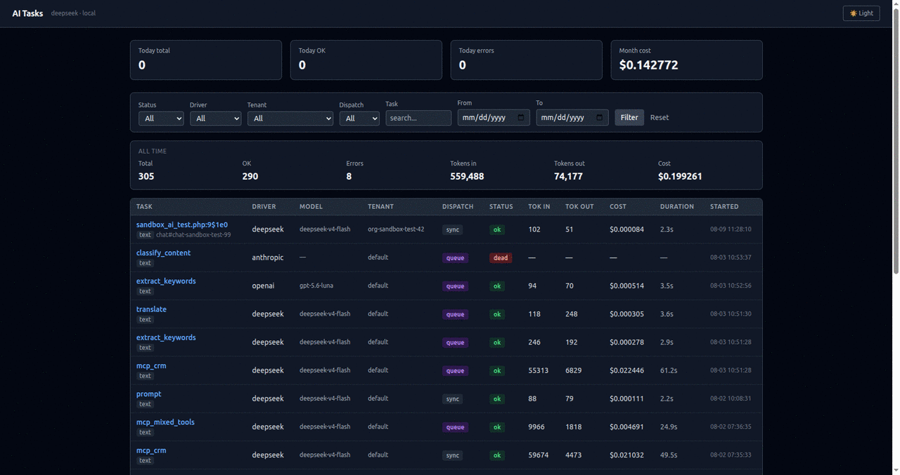

# Laravel AI Tasks

[](https://packagist.org/packages/fomvasss/laravel-ai-tasks)
[](https://packagist.org/packages/fomvasss/laravel-ai-tasks)
[](https://packagist.org/packages/fomvasss/laravel-ai-tasks)

Оркестратор AI-задач для Laravel. Маршрутизація, черги, аудит-лог, бюджети, вебхуки — поверх [laravel/ai](https://laravel.com/docs/ai-sdk) як транспортного шару.

[English](README.md)

Документація англійською — https://fomvasss.github.io/laravel-ai-tasks/ (ті самі сторінки, що в [docs/](docs/index.md)).



- **Маршрутизація з fallback** — ланцюжок драйверів на задачу, наступний пробується, коли провайдер лежить
- **Черги** — ідемпотентність, відкладений запуск, повтори непридатних результатів, хуки `onCompleted()`/`onFailed()`
- **Аудит-лог** — кожен прогін у `ai_runs`: драйвер, модель, токени, вартість, тривалість, статус
- **Бюджети й облік вартості** — на тенанта, драйвер і модель
- **Дашборд** — прогони, стан драйверів, завислі прогони, повтор із браузера
- **Текст, зображення, ембединги, TTS, транскрипція**, інструменти й MCP, structured output, стрімінг
- **`AI::fake()`** для тестів

## Вимоги

- PHP ^8.3
- Laravel ^12 | ^13
- laravel/ai ^1.0

## Встановлення

```bash
composer require fomvasss/laravel-ai-tasks

php artisan vendor:publish --provider="Laravel\Ai\AiServiceProvider" --tag=ai-config
php artisan vendor:publish --tag=ai-tasks-config
php artisan vendor:publish --tag=ai-migrations
php artisan migrate
```

```env
AI_DEFAULT=openai
OPENAI_API_KEY=sk-...
```

> **Безпека:** дашборд `/ai-tasks` за замовчуванням відкритий для всіх. Перед деплоєм задайте `dashboard.middleware`, напр. `['web', 'auth']`.

## Швидкий старт

```bash
php artisan ai:make-task SummarizeTask
```

```php
use Fomvasss\AiTasks\DTO\AiPayload;
use Fomvasss\AiTasks\Tasks\AiTask;
use Laravel\Ai\Messages\UserMessage;

class SummarizeTask extends AiTask
{
    public function __construct(private readonly string $text) {}

    public function modality(): string
    {
        return 'text';
    }

    public function toPayload(): AiPayload
    {
        return new AiPayload(
            modality: 'text',
            messages: [new UserMessage("Summarize: {$this->text}")],
            systemPrompt: 'Reply in 3 sentences max.',
        );
    }
}
```

```php
use Fomvasss\AiTasks\Facades\AI;

$response = AI::send(new SummarizeTask($text));   // синхронно
$runId = AI::queue(new SummarizeTask($text));     // у чергу
AI::stream(new SummarizeTask($text), fn (string $chunk) => print($chunk));
```

## Документація

- [Installation](docs/installation.md) · [Configuration](docs/configuration.md)
- [Tasks](docs/usage/tasks.md) · [Running tasks](docs/usage/running-tasks.md) · [Queued tasks](docs/usage/queued-tasks.md) · [Driver routing](docs/usage/routing.md)
- [Structured output](docs/usage/structured-output.md) · [Tools & MCP](docs/usage/tools.md) · [Tool choice & approval](docs/usage/tool-approval.md) · [Modalities](docs/usage/modalities.md)
- [Budgets & tenants](docs/usage/budgets.md) · [Cost tracking](docs/usage/costs.md) · [Provider override](docs/usage/provider-override.md)
- [Dashboard](docs/usage/dashboard.md) · [Webhooks](docs/usage/webhooks.md) · [Testing](docs/usage/testing.md)
- Guides: [Production checklist](docs/guides/production.md) · [Chat assistant](docs/guides/chat-assistant.md) · [Tools in practice](docs/guides/tools-in-practice.md) · [Provider quirks](docs/guides/provider-quirks.md) · [Testing in practice](docs/guides/testing-in-practice.md)
- Довідник: [AI facade](docs/reference/facade.md) · [AiTask](docs/reference/task.md) · [AiPayload & AiResponse](docs/reference/payload-response.md) · [ai_runs](docs/reference/ai-runs.md) · [Events](docs/reference/events.md) · [Commands](docs/reference/commands.md) · [Providers](docs/reference/providers.md)
- [Upgrading](docs/upgrading.md) · [Changelog](CHANGELOG.md)

## Ліцензія

MIT — дивись [LICENSE](LICENSE.md).

## Підтримка

Якщо цей пакет є корисним для вас, розгляньте можливість підтримки його розробки:

[](https://send.monobank.ua/jar/5xsqtHvVrY)
[](https://ko-fi.com/fomvasss)
[](https://link.trustwallet.com/send?coin=195&address=THLgp6DxiAtbNHvgnKV56vk1L38UuUagKf&token_id=TR7NHqjeKQxGTCi8q8ZY4pL8otSzgjLj6t)

> Адреса USDT TRC20: `THLgp6DxiAtbNHvgnKV56vk1L38UuUagKf`
