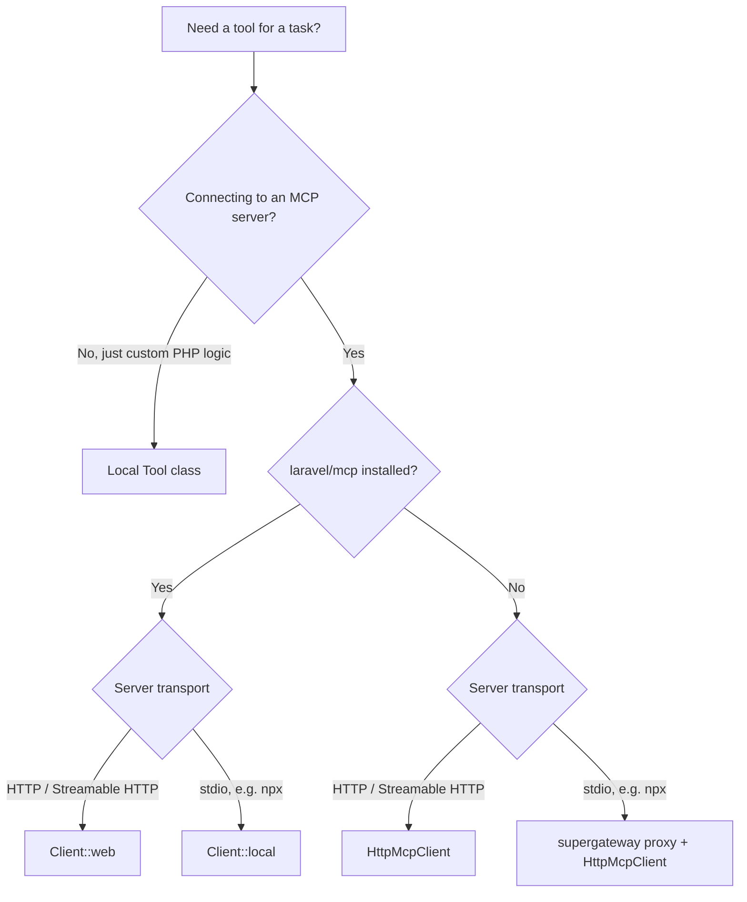

# Tools & MCP

[← Back to README](../README.md)

## Which approach do I need?



- **Local Tool class** → [Local Tools](#local-tools)
- **`Client::web` / `Client::local`** → [Native MCP via laravel/mcp](#native-mcp-via-laravelmcp-recommended)
- **`HttpMcpClient`** → [Remote MCP Tools via HttpMcpClient](#remote-mcp-tools-via-httpmcpclient-zero-dependency-fallback)
- **supergateway proxy** → [stdio MCP via HTTP proxy](#stdio-mcp-via-http-proxy-npx-packages)

`laravel/mcp` (native) is recommended whenever it's an option — it handles the full protocol (handshake, transport negotiation, auth) with no manual adapter code. The `HttpMcpClient`/proxy paths exist only for when you can't or don't want to add that dependency.

## Local Tools

Override `tools()` on any task to pass `Laravel\Ai\Contracts\Tool[]` to the underlying `AnonymousAgent`. Tools are forwarded automatically on `send()`, `stream()`, and `queue()`.

```php
use Illuminate\Contracts\JsonSchema\JsonSchema;
use Laravel\Ai\Contracts\Tool;
use Laravel\Ai\Tools\Request;

class ResearchTask extends AiTask
{
    public function tools(): array
    {
        return [
            new class implements Tool {
                public function name(): string        { return 'web_search'; }
                public function description(): string { return 'Search the web for current information.'; }

                public function handle(Request $request): string
                {
                    $query = $request['query'] ?? '';
                    // call your search API here
                    return json_encode(['results' => ["Result for: {$query}"]]);
                }

                public function schema(JsonSchema $schema): array
                {
                    return ['query' => $schema->string('The search query')];
                }
            },
        ];
    }

    public function modality(): string { return 'text'; }

    public function toPayload(): AiPayload
    {
        return new AiPayload(
            modality: 'text',
            messages: [new UserMessage('What happened in tech this week?')],
        );
    }
}
```

**Note:** anonymous classes implementing `Tool` must define `name()` — without it the tool name resolver falls back to `class_basename()`, which produces an invalid identifier for OpenAI.

The agent decides when and how to invoke tools. Each tool call is executed locally and the result is returned to the model for the next step.

---

## Native MCP via laravel/mcp (recommended)

Since `laravel/ai` >= 0.9, MCP is supported natively through [`laravel/mcp`](https://github.com/laravel/mcp). The package handles the full MCP protocol (handshake, transport negotiation, auth) and `laravel/ai` automatically wraps the returned tool primitives — no manual adapter needed.

**Install:**

```bash
composer require laravel/mcp
```

### Register clients

Register named clients in a service provider:

```php
use Laravel\Mcp\Client;
use Laravel\Mcp\Facades\Mcp;

// AppServiceProvider::boot()

// Remote HTTP server with bearer token
Mcp::registerClient('nightwatch', fn () =>
    Client::web(env('NIGHTWATCH_MCP_URL'))
          ->withToken(env('NIGHTWATCH_TOKEN'))
);

// Remote HTTP server with custom header
Mcp::registerClient('firecrawl', fn () =>
    Client::web(env('FIRECRAWL_MCP_URL'))
          ->withHeaders(['x-api-key' => env('FIRECRAWL_API_KEY')])
);

// Local stdio server — no supergateway proxy needed
Mcp::registerClient('filesystem', fn () =>
    Client::local('npx', ['-y', '@modelcontextprotocol/server-filesystem', storage_path()])
);
```

> **Troubleshooting:** `laravel/mcp` 0.9.0 tightened protocol version negotiation — the client now only accepts servers that negotiate `2025-11-25` or `2025-06-18`. A server that negotiates an older version (`2025-03-26`, `2024-11-05`) now throws `Laravel\Mcp\Exceptions\ClientException` on connect instead of working as before. If a previously-working `Client::web()`/`Client::local()` call starts failing right after a `laravel/mcp` upgrade, this is the first thing to check.

### Task example

Return the client's tools directly from `tools()` — `laravel/ai` auto-wraps them into `McpTool` instances:

```php
use Laravel\Mcp\Facades\Mcp;
use Laravel\Ai\Messages\UserMessage;
use Fomvasss\AiTasks\Traits\SerializesModelsAi;

class NightwatchTask extends AiTask
{
    use SerializesModelsAi;

    public function __construct(private readonly string $question) {}

    public function modality(): string { return 'text'; }

    public function tools(): array
    {
        return Mcp::client('nightwatch')->tools();
    }

    public function toPayload(): AiPayload
    {
        return new AiPayload(
            modality: 'text',
            messages: [new UserMessage($this->question)],
            systemPrompt: 'You are a monitoring assistant. Use the provided tools to inspect application state.',
        );
    }
}
```

```php
AI::send(new NightwatchTask('What exceptions occurred in the last hour?'));
```

### Mix MCP and local tools

Tools from different sources — local, HTTP server, stdio server — go in the same array:

```php
public function tools(): array
{
    return [
        ...Mcp::client('nightwatch')->tools(),
        ...Mcp::client('filesystem')->tools(),
        new SendSlackNotification(),
    ];
}
```

### Reuse server tools in agents

If you expose tools via `laravel/mcp` server, the same classes can be passed directly to an agent — no client connection needed:

```php
use App\Mcp\Tools\SearchIssuesTool;

public function tools(): array
{
    return [new SearchIssuesTool()];
}
```

`laravel/ai` wraps them via `McpServerTool` automatically.

### Caching the tool list

Listing tools makes a round trip to the server. Cache the result to avoid paying that cost on every prompt:

```php
public function tools(): array
{
    return cache()->remember('mcp.nightwatch.tools', 300, fn () =>
        Mcp::client('nightwatch')->tools()
    );
}
```

### Tool name prefix

MCP tools registered via `laravel/mcp` are exposed to the model with the prefix `mcp_tools_`. A tool named `search_issues` becomes `mcp_tools_search_issues`. Keep this in mind when writing system prompts or checking `AI::fake()` assertions.

### Testing

```php
AI::fake([
    new AssistantMessage('Let me check.', [
        new ToolCall(id: '1', name: 'mcp_tools_list_issues', arguments: []),
    ]),
    new AssistantMessage('Found 3 open issues.'),
]);

$response = AI::send(new NightwatchTask('List open issues'));

expect($response->content)->toContain('3 open issues');
```

---

## Remote MCP Tools via HttpMcpClient (zero-dependency fallback)

If you cannot or do not want to install `laravel/mcp`, use the `HttpMcpClient` + `HttpMcpTool` helper classes below. They implement the same Streamable HTTP transport manually with no extra packages required — only `laravel/ai` (already a dependency).

### HttpMcpClient

```php
// app/Ai/Mcp/HttpMcpClient.php
class HttpMcpClient
{
    private int $id = 0;

    public function __construct(
        private readonly string $url,
        private readonly string $token = '',
        private readonly array $headers = [],
    ) {}

    public function listTools(): array
    {
        return $this->rpc('tools/list')['tools'] ?? [];
    }

    public function readResource(string $uri): string
    {
        $result = $this->rpc('resources/read', ['uri' => $uri]);
        return collect($result['contents'] ?? [])
            ->map(fn($c) => $c['text'] ?? '')
            ->filter()
            ->implode("\n");
    }

    public function callTool(string $name, array $arguments = []): string
    {
        $result  = $this->rpc('tools/call', ['name' => $name, 'arguments' => $arguments]);
        $content = $result['content'] ?? [];
        $isError = $result['isError'] ?? false;
        $text = collect($content)
            ->filter(fn($c) => ($c['type'] ?? '') === 'text')
            ->map(fn($c) => $c['text'] ?? '')
            ->implode("\n");
        if ($isError) {
            throw new \RuntimeException("MCP tool error [{$name}]: {$text}");
        }
        return $text ?: json_encode($result);
    }

    private function rpc(string $method, array $params = []): array
    {
        $http = Http::withHeaders(array_merge(
            ['Accept' => 'application/json, text/event-stream'],
            $this->headers,
        ));
        if ($this->token !== '') {
            $http = $http->withToken($this->token);
        }

        $body = [
            'jsonrpc' => '2.0',
            'id'      => ++$this->id,
            'method'  => $method,
            'params'  => empty($params) ? (object) [] : $params,
        ];

        $response = $http->withBody(json_encode($body), 'application/json')->post($this->url);
        $raw      = $response->body();

        // Streamable HTTP may return SSE: "event: message\ndata: {...}"
        if (str_contains($raw, 'data:')) {
            foreach (explode("\n", $raw) as $line) {
                if (str_starts_with($line, 'data:')) {
                    $raw = trim(substr($line, 5));
                    break;
                }
            }
        }

        $data = json_decode($raw, true) ?? [];

        if (isset($data['error'])) {
            $msg = $data['error']['message'] ?? json_encode($data['error']);
            throw new \RuntimeException("MCP error [{$method}]: {$msg}");
        }

        return $data['result'] ?? [];
    }
}
```

Usage examples with different auth schemes:

```php
// Bearer token (Apify, most hosted servers)
new HttpMcpClient(url: '...', token: env('APIFY_TOKEN'));

// Custom header key (Firecrawl, xquik, mcp-proxy)
new HttpMcpClient(url: '...', headers: ['x-api-key' => env('FIRECRAWL_API_KEY')]);

// Multiple headers
new HttpMcpClient(url: '...', headers: [
    'x-api-key'    => env('SERVICE_API_KEY'),
    'x-account-id' => env('SERVICE_ACCOUNT_ID'),
]);

// No auth (context7)
new HttpMcpClient(url: 'http://localhost:8808/mcp');
```

### HttpMcpTool

```php
// app/Ai/Mcp/HttpMcpTool.php
class HttpMcpTool implements Tool
{
    public function __construct(
        private readonly HttpMcpClient $client,
        private readonly string $name,
        private readonly string $toolDescription,
        private readonly array $inputSchema,
    ) {}

    public function name(): string        { return $this->name; }
    public function description(): string { return $this->toolDescription; }

    public function handle(Request $request): string
    {
        return $this->client->callTool($this->name, $request->all());
    }

    public function schema(JsonSchema $schema): array
    {
        if (empty($this->inputSchema)) return [];
        try {
            $type = \Illuminate\JsonSchema\JsonSchema::fromArray(
                \Laravel\Ai\Schema\SchemaNormalizer::normalize($this->inputSchema)
            );
        } catch (\Throwable) {
            return [];
        }
        return $type instanceof \Illuminate\JsonSchema\Types\ObjectType
            ? (fn(): array => $this->properties)->call($type)
            : [];
    }
}
```

### Task example

```php
use Fomvasss\AiTasks\Traits\SerializesModelsAi;

class CrmTask extends AiTask
{
    use SerializesModelsAi;

    private ?HttpMcpClient $mcpClient = null;

    public function __construct(private readonly string $question) {}

    public function tools(): array
    {
        $client = $this->client();
        return collect($client->listTools())
            ->map(fn(array $t) => new HttpMcpTool(
                client: $client,
                name: $t['name'],
                toolDescription: $t['description'] ?? $t['name'],
                inputSchema: $t['inputSchema'] ?? [],
            ))
            ->all();
    }

    public function toPayload(): AiPayload
    {
        $me = $this->client()->readResource('crm://me');
        return new AiPayload(
            modality: 'text',
            messages: [new UserMessage($this->question)],
            systemPrompt: "Current user: {$me}\nUse provided tools to answer.",
        );
    }

    private function client(): HttpMcpClient
    {
        return $this->mcpClient ??= new HttpMcpClient(
            url: config('services.crm_mcp.url'),
            token: config('services.crm_mcp.token'),
        );
    }

    public function modality(): string { return 'text'; }
}
```

```php
AI::send(new CrmTask('Show workload for all users'));
AI::queue(new CrmTask('Create a task "Fix login bug" in project CRM, priority 3'));
```

---

## stdio MCP via HTTP proxy (npx packages)

Most community MCP servers (e.g. `@upstash/context7-mcp`, `@modelcontextprotocol/server-filesystem`) use **stdio transport** — they communicate over stdin/stdout, not HTTP.

**With `laravel/mcp`:** use `Client::local(...)` directly (see [Register clients](#register-clients) above) — no proxy needed.

**Without `laravel/mcp`:** use [supergateway](https://github.com/supermaven-inc/supergateway) to expose any stdio server as a Streamable HTTP endpoint, then point `HttpMcpClient` at it.

### Setup (supergateway)

```bash
# Start proxy (run once; restarts needed after container/machine reboot)
npx -y supergateway \
  --stdio "npx -y @upstash/context7-mcp" \
  --port 8808 \
  --outputTransport streamableHttp \
  > /tmp/context7-mcp.log 2>&1 &

# Verify (~8 s startup time)
curl -s http://localhost:8808/mcp \
  -H "Accept: application/json, text/event-stream" \
  -H "Content-Type: application/json" \
  -d '{"jsonrpc":"2.0","id":1,"method":"tools/list","params":{}}' \
  | grep -o '"name":"[^"]*"'
# → "name":"resolve-library-id"  "name":"get-library-docs"
```

Add to `config/services.php`:

```php
'context7_mcp' => [
    'url' => env('CONTEXT7_MCP_URL', 'http://localhost:8808/mcp'),
],
```

### Task

```php
use Fomvasss\AiTasks\Traits\SerializesModelsAi;

class McpContext7Task extends AiTask
{
    use SerializesModelsAi;

    private ?HttpMcpClient $mcpClient = null;

    public function __construct(private readonly string $question) {}

    public function modality(): string { return 'text'; }

    public function tools(): array
    {
        $client = $this->client();
        return collect($client->listTools())
            ->map(fn(array $t) => new HttpMcpTool(
                client: $client,
                name: $t['name'],
                toolDescription: $t['description'] ?? $t['title'] ?? $t['name'],
                inputSchema: $t['inputSchema'] ?? [],
            ))
            ->all();
    }

    public function toPayload(): AiPayload
    {
        return new AiPayload(
            modality: 'text',
            messages: [new UserMessage($this->question)],
            systemPrompt: 'You are a helpful developer assistant with access to up-to-date library documentation via Context7. Always use the provided tools to fetch relevant docs before answering.',
        );
    }

    private function client(): HttpMcpClient
    {
        return $this->mcpClient ??= new HttpMcpClient(
            url: config('services.context7_mcp.url'),
        );
    }
}
```

```php
AI::send(new McpContext7Task('How do I use simplePaginate in Laravel?'));
AI::send(new McpContext7Task('Show Redis queue examples in Laravel'));
```

### Running in production

For long-running environments, manage the proxy as a supervised process:

**Supervisor (`/etc/supervisor/conf.d/context7-mcp.conf`):**
```ini
[program:context7-mcp]
command=npx -y supergateway --stdio "npx -y @upstash/context7-mcp" --port 8808 --outputTransport streamableHttp
autostart=true
autorestart=true
stderr_logfile=/var/log/context7-mcp.err.log
stdout_logfile=/var/log/context7-mcp.out.log
```

**Docker Compose (separate service):**
```yaml
context7-mcp:
  image: node:20-alpine
  command: npx -y supergateway --stdio "npx -y @upstash/context7-mcp" --port 8808 --outputTransport streamableHttp
  ports:
    - "8808:8808"
  restart: unless-stopped
```

Then set `CONTEXT7_MCP_URL=http://context7-mcp:8808/mcp` in `.env`.
