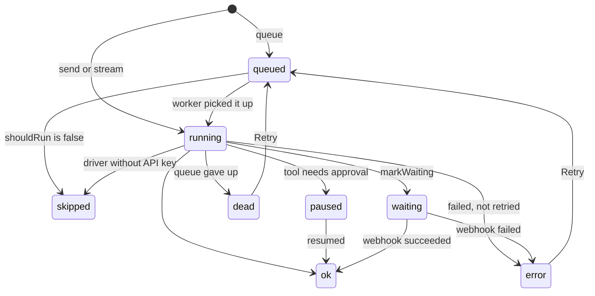

# The ai_runs table

Every provider call creates a row in `ai_runs` (the name is set by `table` in the config). Model — `Fomvasss\AiTasks\Models\AiRun`, UUID primary key.

A sync call with fallback leaves one row per tried driver; a queued run is one row whatever driver answered.

## Columns

| Column | Description |
|---|---|
| `id` | UUID; returned by `AI::queue()` |
| `tenant_id` | Tenant the run is billed to |
| `task` | [Task name](../usage/tasks.md#task-name) |
| `driver` | Driver that answered |
| `user_id` | Who started the run, see [User](../usage/budgets.md#user) |
| `model` | Model used |
| `modality` | `text`, `image`, `embed`, `audio`, `transcription` |
| `subject_type`, `subject_id` | Record the run concerns, see [Subject](../usage/budgets.md#subject) |
| `dispatch` | `sync` or `queue` |
| `status` | See below |
| `error` | Error message |
| `idempotency_key` | Unique; queued runs only, see [Idempotency](../usage/queued-tasks.md#idempotency) |
| `request` | Modality, options, meta, `task_class`, `execution_context` (when the task has one); with `store_request` also messages, system prompt and `task_args`; for queued runs `dispatch_id` and `available_at` (due time of a delayed run) |
| `response` | Response content and metadata |
| `tokens_in`, `tokens_out`, `cache_read_tokens`, `cache_write_tokens` | See [Tokens](../usage/costs.md#tokens) |
| `cost` | USD |
| `cost_rates` | Rates snapshot, see [Cost tracking](../usage/costs.md#rates-snapshot) |
| `started_at`, `finished_at`, `duration_ms` | Timing |
| `created_at`, `updated_at` | |

## Statuses

| Status | Meaning |
|---|---|
| `queued` | Dispatched, waiting for a worker |
| `running` | Provider call in progress; a queued run also stays here between retry attempts |
| `waiting` | Parked until a provider webhook, see [Webhooks](../usage/webhooks.md) |
| `ok` | Finished with a result |
| `paused` | The call finished and waits for a tool approval decision, see [Resuming](../usage/tool-approval.md#resuming) |
| `error` | Failed and not retried by the queue: a sync attempt failed, the driver returned `ok: false`, or the post-call budget check rejected the response |
| `dead` | Queued run failed after all retries, or closed by hand |
| `skipped` | `shouldRun()` returned `false`, or a sync call skipped a driver without an API key |



`stuck` is not a status but a condition: `queued`/`running` without progress for longer than `dashboard.stuck_after_minutes`.

## Model methods

| Method | Description |
|---|---|
| `AiRun::stuck(?int $minutes = null)` | Scope: stuck runs |
| `isStuck(?int $minutes = null): bool` | Whether the run is stuck |
| `canRetry(): bool` | Whether the dashboard / `ai:retry` can re-dispatch it |
| `isSuperseded(): bool` | A failed sync attempt whose fallback driver answered; `response.superseded_by` holds the id of that row |
| `isPaused(): bool`, `pauseExpired(): bool` | Waiting for an approval decision; past `approvals.ttl_minutes` |
| `executionContext(): array` | The context captured at dispatch, see [Acting as a user](../guides/tools-in-practice.md#acting-as-a-user) |
| `markWaiting(array $extra = [])` | Park the run until a webhook; `$extra` goes to `response`, e.g. `provider_run_id` |
| `abandon(string $reason)` | Mark `dead` without firing `AiRunFailed` |

```php
use Fomvasss\AiTasks\Models\AiRun;

AiRun::where('task', 'summarize')->where('status', 'dead')->latest()->get();
AiRun::where('subject_type', 'order')->where('subject_id', $order->id)->get();
AiRun::stuck()->count();
```
