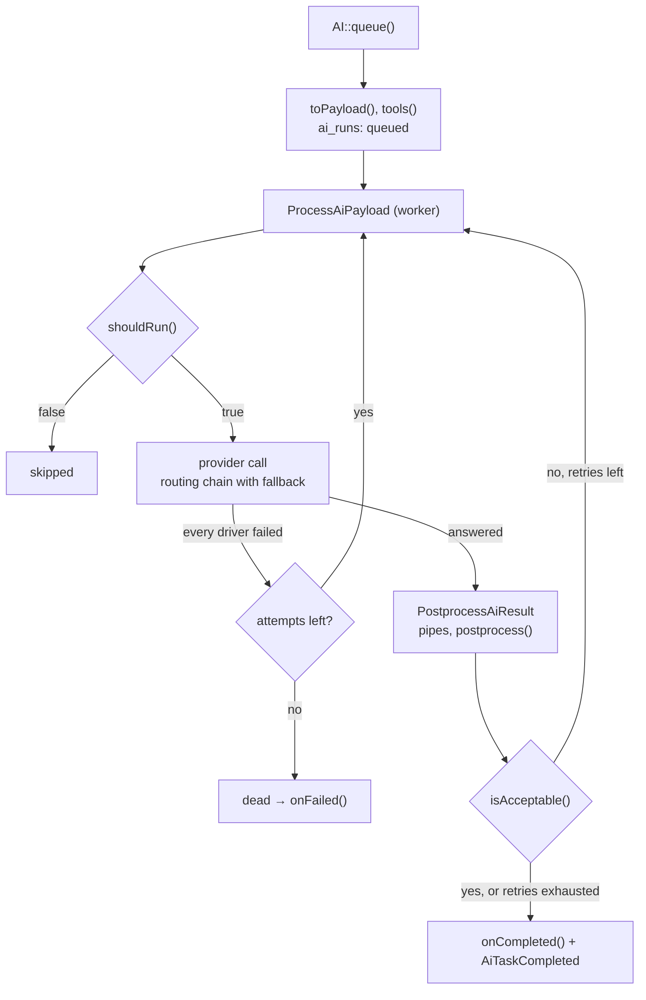

# Queued tasks

`AI::queue()` creates an `ai_runs` row with status `queued` and dispatches two jobs in turn:

1. `ProcessAiPayload` — the provider call, on the `ai` queue
2. `PostprocessAiResult` — global pipes, `postprocess()`, `isAcceptable()`, retries, `onCompleted()`, on the `ai-post` queue

```php
$runId = AI::queue(new SummarizeTask($article));
```

Any task can be queued. Queue setup for workers — [Installation](../installation.md#queues-and-horizon).



## Where each step runs

| Step | Runs | Uses |
|---|---|---|
| `toPayload()`, `tools()`, `schema()`, `toolChoice()` | in `AI::queue()`, in the calling process | the task as constructed by the caller |
| provider call | worker, `ProcessAiPayload` | the payload serialized into the job |
| `shouldRun()`, `postprocess()`, `isAcceptable()`, `onCompleted()`, `onFailed()` | worker | a task rebuilt from `serializeForQueue()` |

So the prompt reflects the data at dispatch time, while the hooks see fresh data — a model restored by `SerializesModelsAi` is re-read from the database. Tools are serialized with the payload: anonymous tool classes can't be queued, see [Tools in queued tasks](tools.md#tools-in-queued-tasks).

`postprocess()` on the worker gets the response restored from `ai_runs.response`: `content`, `structured`, `toolCalls`, `finishReason`, `pendingApprovals`. `usage` is empty there — tokens and cost are in the run (`$event->run` in `AiTaskCompleted`).

## Serializing the task

The task is rebuilt on the worker from its constructor arguments: `serializeForQueue()` returns them as an array, `fromQueueArgs()` passes them back to the constructor via `new static(...$args)`.

The easy way is `use SerializesModelsAi;` (added by `ai:make-task` automatically). It serializes every promoted constructor property, swapping Eloquent models and model collections for identifiers — the worker gets a fresh instance from the database, not a snapshot from dispatch time:

```php
use Fomvasss\AiTasks\Traits\SerializesModelsAi;

class SummarizeTask extends AiTask
{
    use SerializesModelsAi;

    public function __construct(
        private readonly Article $article,
        private readonly int $maxWords = 50,
    ) {}
}
```

Limits of the trait:

- every constructor parameter must be a promoted property (`private readonly Foo $foo`)
- a plain PHP array of models is not swapped — use an Eloquent collection
- everything except models must be JSON-safe: scalars and arrays of scalars

Without the trait, implement `serializeForQueue()` yourself and return only scalars.

`AI::queue()` throws a `LogicException` for a task that has required constructor parameters but whose `serializeForQueue()` returns `[]` — such a task can't be rebuilt on the worker.

## Queue and connection

Implement `ShouldQueueAi` to route the task's jobs to other queues or a connection:

```php
use Fomvasss\AiTasks\Contracts\ShouldQueueAi;

class AnalyzeTask extends AiTask implements ShouldQueueAi
{
    public function viaQueues(): array
    {
        return ['request' => 'ai-heavy', 'post' => 'ai-post'];
    }
}
```

`request` is the provider call (`ProcessAiPayload`), `post` is the postprocess job (`PostprocessAiResult`). Or per instance:

```php
AI::queue((new AnalyzeTask($product))->onQueue('ai-heavy')->onConnection('redis'));
```

> [!WARNING]
> Every queue name you return must be consumed by a worker. A job dispatched to a queue nobody listens to sits there forever — the run stays `queued` and shows up as [stuck](dashboard.md#stuck-runs).

## Delayed dispatch

```php
AI::queue(new SummarizeTask($article), delay: 300);                // seconds
AI::queue(new SummarizeTask($article), delay: now()->addHours(2)); // Carbon
AI::queue(new SummarizeTask($article), delay: new \DateInterval('PT10M'));
```

> [!WARNING]
> The run is created as `queued` right away. A delay longer than `dashboard.stuck_after_minutes` makes it look [stuck](dashboard.md#stuck-runs) before it is due. Don't retry such a run from the dashboard or with `ai:retry --stuck` — the delayed job would still run later, and the task would execute twice.

## Job timeout

Override `jobTimeout()` to control how long the queue job may run before the worker kills it:

```php
class HeavyAnalysisTask extends AiTask
{
    // default is 300 seconds; raise for long multi-step tool chains
    public function jobTimeout(): int
    {
        return 600;
    }
}
```

The Horizon supervisor `timeout` must be at least as large as your highest `jobTimeout()`. The HTTP timeout of the provider call itself is separate — `options['timeout']`, see [Running tasks](running-tasks.md#long-responses).

## Pre-execution guard — `shouldRun()`

`shouldRun()` is checked inside the job, **before** the provider call. If it returns `false`, the run is marked `skipped` and no tokens are consumed:

```php
public function shouldRun(): bool
{
    // re-check at execution time — the record may have changed
    return $this->product->fresh()?->needs_analysis ?? false;
}
```

Useful when a queued task may become irrelevant by the time a worker picks it up: record deleted, status changed, result already computed.

## Idempotency

A queued run is protected against duplicates by a unique `idempotency_key` in `ai_runs` — a hash of tenant ID, task name, modality and `serializeForQueue()`.

- **Deduplication is active only when `serializeForQueue()` returns a non-empty array.** With `[]` (the default) there is no key and runs of the same task can coexist.
- On collision `AI::queue()` returns the existing run id and dispatches nothing.
- `AI::send()` always makes a fresh call and stores no key.

What matters is what `serializeForQueue()` includes. For a chat assistant where the same question can be asked twice, put a message id or the history into the constructor — each turn then gets a different key, and only genuine technical duplicates (double-send, queue retry) are blocked:

```php
public function __construct(
    private readonly string $question,
    private readonly string $messageId, // unique per message
    private readonly array $history = [],
) {}
```

### Deduplication window

By default the key never expires — the same task with the same arguments is never queued twice. Override `idempotencyWindow()` to scope it to a period; the returned string becomes part of the key:

```php
public function idempotencyWindow(): ?string
{
    return now()->format('Y-m-d'); // at most one run per day for the same args
}
```

## Failures and job retries

The job tries the whole [routing chain](routing.md): when a driver fails transiently, the next one is tried within the same attempt, and `ai_runs.driver` records the driver that answered.

If every driver fails, the job retries the chain from the start. The limits are set on the jobs themselves and take precedence over the worker's / Horizon supervisor's `tries`:

| Job | `tries` | `backoff` |
|---|---|---|
| `ProcessAiPayload` | 3 | 10, 30, 120 seconds |
| `PostprocessAiResult` | 3 | — |

Between attempts the run stays `running` with the last error recorded; it becomes `dead` — firing `AiRunFailed` and `onFailed()` once — only when the queue gives up.

A rejected request (4xx other than 408/429) skips the remaining fallback drivers, but the job itself is still retried like any other exception.

Not retried at all — the run ends as `error` with `onFailed()` right away:

- the driver returned a response with `ok: false`
- the budget is exceeded

## Retrying an unacceptable result

A provider can respond "successfully" with an unusable result — most commonly a reasoning model (DeepSeek, Gemini thinking) spending its whole token budget on reasoning and returning blank content. Implement `maxRetries()` and `isAcceptable()`:

```php
public function maxRetries(): int
{
    return 1;
}

public function isAcceptable(AiResponse|array $result): bool
{
    return ! empty($result['ok']) && trim(strip_tags($result['message'] ?? '')) !== '';
}
```

`isAcceptable()` receives whatever `postprocess()` returned. Nothing else is needed: `PostprocessAiResult` derives the retry's idempotency key itself (`<key>-retry<n>`) and dispatches a fresh job pair on the same driver. The task never sees its attempt number.

Once retries are exhausted (or immediately with the default `maxRetries() = 0`), the result is final — `onCompleted()` gets `$attemptsExhausted = true` for an unresolved one. Applies only to `AI::queue()`; `send()`/`stream()` run once.

> [!NOTE]
> The attempt number isn't stored in a column — only in the `idempotency_key` suffix (`-retry1`, `-retry2`). The dashboard doesn't show the retry chain.

## The `onCompleted()` hook

For a task with a single consumer, override `onCompleted()` instead of writing an `AiTaskCompleted` listener:

```php
public function onCompleted(AiResponse|array $result, bool $attemptsExhausted): void
{
    if ($attemptsExhausted) {
        $this->message->chat->assignToManager();
        return;
    }

    // save the reply, broadcast it, etc.
}
```

- Called exactly once, when `AiTaskCompleted` fires — after `postprocess()`/`isAcceptable()` settled on a final result. Not called for rejected intermediate attempts.
- An exception thrown from it is caught, logged and fires `AiTaskCompletedHandlerFailed`; it never breaks the pipeline or stops `AiTaskCompleted`.
- Works for `send()` and `stream()` too.

Keep an `AiTaskCompleted` listener when several independent consumers react to the same task. Both can be used together.

## The `onFailed()` hook

The counterpart of `onCompleted()`: called exactly once when the task ends **without** a result — every driver of the chain failed (for a queued task, on every retry), the provider rejected the request, a streamed answer broke off midway, or the budget was exceeded.

```php
public function onFailed(\Throwable|string $reason): void
{
    $this->chat->assignToManager();
}
```

For a queued task it runs once the queue gives up, not on intermediate attempts. An exception thrown from it is logged and never replaces the original error. To react from outside the task, listen to `AiTaskFailedFinally` — its `$run` is `null` when nothing was started (budget already exceeded).
